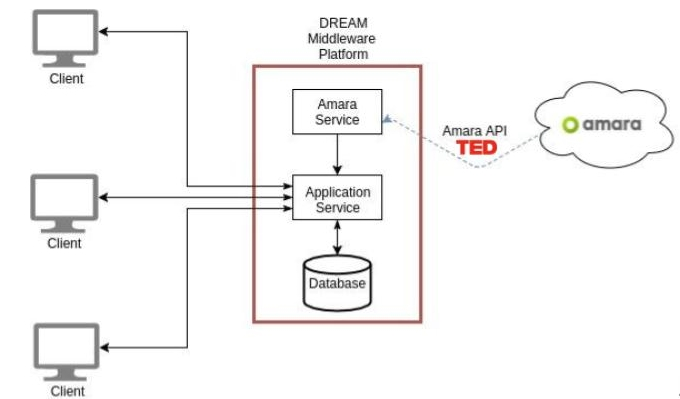

## DREAMTV Middle-ware platform
 
DREAMTV - Middle-ware platform to gather the videos from Amara and save users’ recollected data. 

[DREAM Project](https://sites.google.com/a/unitn.it/rise-dream/)- Social Participation for improving emotional, mental, and physical well-being in independently living older Adults.  

Development of a smart TV application (client side: Android TV platform; server side: Laravel Framework) for the social inclusion of older adults. 

### Architecture
Our system consist in a middle-ware platform (to gather the videos from Amara and save users’ recollected data), and a smart TV application.

With the Amara Service we could retrieve all the videos corresponding to the team TED and all its projects like Ted Talks, Ted Ed, TedXTalks, and others. We could access to details of these videos and their subtitles. Also, we could retrieve all the tasks assigned to this team.

#### Technical specifications

* Laravel 5.4, is a free, open-source PHP web framework.
* mysql-server

#### BD Scheme

The database of subtitles with errors will help improve the quality of these subtitles by marking the subtitle containing error, or errors for volunteer translators to review. This will speed up their revision process, and mark the need to re-do a quality check, so that the next revision of the subtitles can be error-free. They will access to users' selections and comments via the web interface.

#### API description

http://www.dreamproject.pjwstk.edu.pl:8000/docs/
